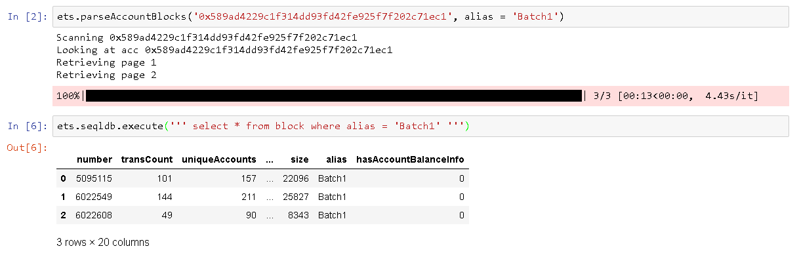

# EthToSql

This is a package that I built to use on my MSc Dissertation that parses blocks from an Ethereum Node, transforms the data into a relational format and inserts it into a relational database. It uses sqlalchemy to interact with the database so it should work with any vendor supported by it. I started the project using Amazon Redshift but given the limited amount of credits I had I moved to Sql Server Express Edition. I can guarantee though that the data collection process works on both.

Example of how to use it: 


## The basics

* When the package is initialized, it will try to connect to the DB using the provided connection string.
* The package does not create the DB. Make sure it already exists.
* If the DB is SQL Server, the package then will attempt to create the DB tables if a table named "Block" doesn’t exist.
* This is not a robust process as it works under the assumption that if table "block" doesn’t  exist, none of the other tables exist so it will attempt to create them all.
* If table block doesn’t  exist but any of the other do, it will fail as it will try to recreate the existing table.
* You dont have to create the tables as sqlAlchemy will do that on your behalf but the data types won't be the best (it will create a lot of varchar(max))

## How to install it

```
pip install ethToSql
```

## How to use it

Create an Object and call any native Geth function:

```python
import ethToSql as eTS

###Initial Variables
host = 'https://YourHostAddress'
port = 7546
#Sql Server localhost connection string to a DB called DBTest
conString = 'mssql+pyodbc://localhost/{}?driver=SQL+Server+Native+Client+11.0'.format('DBTest') 

##Create the object
ets = eTS.ethToSql(host, port, conString)

#Can use any function exposed by the JSON RPC API
#https://github.com/ethereum/wiki/wiki/JSON-RPC#json-rpc-api

##Example 1: eth_blockNumber function
print(
    ets.hexToInt(
        ets.makeRpcRequest('eth_blockNumber', []) #returns in hexa
    )
)
#5980493

#Example 2: eth_syncing function
ets.makeRpcRequest('eth_syncing', []) #raw return

#{'currentBlock': '0x5b4301',
# 'highestBlock': '0x5b4302',
# 'knownStates': '0x0',
# 'pulledStates': '0x0',
# 'startingBlock': '0x5b42ff'}

```

The package offers hexToInt and intToHex functions to facilitate conversion.


## Core functions

### Parse Single Block 
The  main function is called "parseBlock" and it will, as the name suggests, parse a block given its number

```python
ets.parseBlock(bnum = 3000000,           #block number
               alias = 'Test',     #an alias that is saved on the Block Table
               getBalanceInfo=0,   #Get the ballance of each account that had transactions on that block 
               SAVE_TO_DB = True,  #whether or not save to the DB
               printAtEnd = 1)     #print message at the end
               
#Finished block 3000000 with: 6 transactions, 8 unique accounts and 1 contracts created
```
It will populate the 4 tables shown on the diagram below:


* The all the Aliases will be "other" as the code that populate this table is not available here.
* A forth table called AccountBalances containing the balance of each account on each block is not being showed.
* Bear in mind that setting the getBalanceInfo flag to 1 will populate that table by calling the "eth_getBalance" function for each account that participated on a transaction in the block, which will drastically increase run time.
* A full node is necessary to use the getBalanceInfo flag for older blocks due to the state tree pruning  that takes place on light nodes.


### Run queries

The database object exposes an execute function that can be used to run any sort of query:
```python
print(ets.seqldb.execute('select * from block'))
ets.seqldb.execute('delete from block')
```

### Parse Consecutive Range of Blocks

The parseRange function parses a range of blocks. It checks if the block is already on the DB to avoid parsing it twice

```python
ets.parseRange(1,  #start
               20, #end
               alias = 'Test', getBalanceInfo=0, SAVE_TO_DB = True, printAtEnd = 0)
```
Suggest setting printAtEnd = 0 because the parse range uses tqdm to track progress
OBS: this function is perfectly safe to be used more than once in parallel (having many workers runing the same function - I tried with more than 5) but be aware that, if the ranges overlap, you'll get a bunch of Primary key errors on the "failures" table because the check that I mention above is done by creating a list of existing blocks and checking if the block thats about to be parsed is in that list. The function below is more robust in dealing with this situation.

## Parse an Account

It is also possible to parse all the blocks in wich an account has transactions in.
That is achieved using BeautifulSoup to parse the HTML from etherscam. 
There is a hard coded limit of 100 transactions to prevent the function from running "forever" in case of big accounts, but that can be increased by changing the "translimit" variable.
The accout's Alias (that string besides the name on Ethersam) is also captured and inserted\updated on the Database if the necessary procedure is created. Can disable that by setting the updateAlias to 0.




## Clean up methods

The parseRange and parseAccount methods handles exception, so if a block fail for whatever reason, a row will be inserted into the "failures" table.

Most of the times, the failures are due to timeouts, so calling the parse function again should work.
There are two functions to do that, one works by block number and the other that by querying the "failures" table and calling the former function for each block on the table.
The clean up code is pretty self explanatory and a few examples can be seen here:


## A few extra important details

Please note that this was not build to be run at "production" capacity. There are in fact a lot of "shortcuts" that were taken due to the limited amount of time I had to code and the fact that this is a "one time project". 
The process of writing to the database for example is done using the ".to_sql" function from a pandas data frame, so a lot of (probably unnecessary	) data frames are created in the process. The tables structure could also have been improved by having account keys on the transaction table for example and the "AccountAlias" and Contract table could be the same.

In terms of code, the main function "parseBlock" has no exception handling it it, so it may fail during execution (although unlikely) leaving a block with missing information. I suggest wrapping the "parseBlock" call on a try except and outputing the block number that caused the error error to a table called "failures" (as the code example given above) since the clean up methids are available. I say that because the code is pretty robust as I've parsed over 600k blocks so the exceptions, if any, will probably be from the host eventually timing out.

Foreign keys are not being created automatically. You may want to do that manually if you are planning to download and analyse a lot of data.

